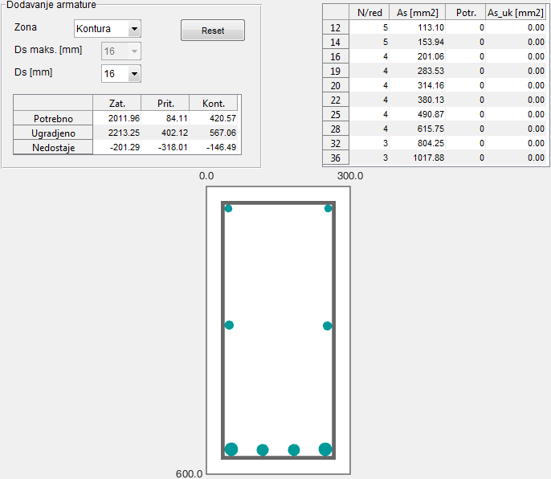

## Interfejs za dimenzionisanje prema momentu savijanja {#interfejs-za-dimenzionisanje-prema-momentu-savijanja}

Na slici 12.1 prikazan je izgled interfejsa za dimenzionisanje prema momentu savijanja sa ili bez normalne sile. Prvi korak u karakterističnom radnom procesu programa predstavlja definisanje karakteristika betona i armature za presjek usvojen u prethodnom dijelu:

*   Beton
    *   klasa betona
    *   koeficijent
    *   parcijalni koeficijent sigurnosti za beton,
    *   dopuštene dilatacije u betonu – automatski se usvaja na osnovu odabrane klase betona
*   Armatura
    *   modul elastičnosti,
    *   karakteristična čvrstoća na zatezanje,
    *   parcijalni koeficijent sigurnosti za čelik,

Program automatski pretpostavlja statičku visinu na , ukoliko korisnik drugačije ne definiše. Da bi se pravilno odredila granica jednostrukog armiranja presjeka, potrebno je definisati odnos . Ukoliko nije zadano drugačije, program automatski usvaja maksimalne dopuštene vrijednosti definisane u dijelu 8.1.1.1\.

Slika 12.1 – Grafički interfejst za dimenzionisanje prema momentu savijanja

Konačno, zadaju se računske vrijednosti i . Ukoliko je uključena opcija o_jačanje čelika_, program će koristiti radni dijagram čelika sa ojačanjem (izraz 5.3). Klikom na dugme _Izračunaj As_ program u tabeli prikazuje potrebne količine armature i . U dijagramima ispod prikazani su redom poprečni presjek sa osjenčenom pritisnutom zonom, dijagram dilatacija i dijagram napona u betonu sa obilježenom rezultantnom silom pritiska. U narednom koraku klikom na dugme _Dodaj armaturu..._ otvara se poseban prozor sa interfejsom za dodavanje podužne armature (slika 12.2).

Slika 12.2 – Grafički Interfejs za dodavanje podužne armature

Korisnik prvo bira u padajućem meniju zonu presjeka u koju želi da doda podužnu armaturu, i to:

*   zona zatezanja,
*   zona pritiska,
*   konturna zona,

pri čemu konturna zona predstavlja lijevu i desnu ivicu presjeka gdje se postavlja pripadajući dio podužne armature za prenos momenta torzije, o čemu će biti riječi kasnije. Odabirom zone zatezanja, program uvećava zategnuti dio presjeka koji je prikazan u donjem dijelu prozora.

Preko _Ds maks._ padajućeg menija korisnik bira maksimalni prečnik armature, na osnovu čega program računa maksimalan broj šipki armature koje mogu stati u jednom redu i generiše pomoćnu mrežu linija čije presječne tačke predstavljaju moguće mjesto za dodavanje šipke armature. Preko padajućeg menija _Ds_ ili preko točkića na mišu, korisnik bira prečnik šipke koja će približnim klikom na neki od mogućih položaja šipke biti ugrađena. Zahvaljujući tome, moguće je kombinovati više šipki različitog prečnika.

U tabeli ispod padajućeg menija prikazane su potrebne, ugrađene i nedostajuće količine armature po zonama, na osnovu čega korisnik ima bolji pregled koliko još armature treba da doda. U slučaju kada korisnik doda malo veću količinu armature, količina nedostajuće armature prelazi u minus za odgovarajući iznos. U tabeli u desnom dijelu prozora korisnik u svakom trenutku ima pregled podataka za šipke različitog prečnika, i to:

1.  koliko šipki datog prečnika može stati u jednom redu,
2.  površinu jedne šipke,
3.  ukupno potreban broj šipki datog prečnika i
4.  ukupnu površinu potrebnog broja šipki.

Šipke su prikazane u realnoj razmjeri, zbog čega ih je ponekad teško razlikovati. Taj problem je riješen prikazivanjem prečnika šipke u pomoćnom balončiću kada korisnik pređe mišem preko nje (slika 12.3).

Slika 12.3 – Dodavanje armature i prikaz prečnika šipki

Pojedinačna šipka se može obrisati desnim klikom na samu šipku, dok dugme _Reset_ briše sve šipke iz odabrane zone. Program istovremeno prati da količina pritisnute ili zategnute armature nije veća od maksimalne dopuštene (izraz 7.5), u kom slučaju prikazuje upozorenje.

Ovakav interfejs omogućava brzo i jednostavno usvajanje armature, bez razmišljanja o dopuštenim razmacima između šipki, te minimalnoj i maksimalnoj količini armature. Jedini nedostatak na koji treba obratiti pažnju u slučaju zgusnutog rasporeda šipki, jeste da program ne uzima u obzir smanjenje širine prvog reda zbog minimalnog radijusa povijanja uzengija, ali bi se daljim razvojem programa i taj problem mogao riješiti.

Nakon ugradnje potrebne količine podužne armature po zonama, korisnik može jednostavno zatvoriti ovaj prozor i vratiti se na rad u glavni interfejs programa.

Slika 12.4 – Ažuriran prikaz za proračun momenta savijanja

Kao što se vidi na slici 12.4, u donjem dijelu prozora program automatski ažurira prikaz presjeka zajedno sa ugrađenim šipkama armature. Klikom na dugme _Izračunaj Mrd,_ program traži ravnotežni položaj neutralne ose za koji će rezultantna sila pritiska u gornjoj zoni biti jednaka rezultantnoj sili zatezanja u donjoj zoni presjeka. Za taj položaj neutralne ose program generiše dijagram dilatacija po visini presjeka, te dijagram napona pritiska u betonu zajedno sa rezultantnim silama u betonu i armaturi i računa njihov reaktivni moment savijanja . U slučaju kada je zadana normalna sila , i ona se ucrtava u težištu presjeka. Pored svake ucrtane sile, obilježen je njen tačan položaj u odnosu na pritisnutu ivicu presjeka, mjereno u, kao i njen intenzitet u . Zahvaljujući tome, korisnik na jednostavan način može provjeriti tačnost prikazanog rezultata ručnim proračunom.

Dodatnu pogodnost programa predstavlja opcija za generisanje dijagrama za usvojeni presjek i armaturu (slika 12.5), koja se aktivira klikom na dugme _Plot M-Phi_. Zahvaljujući tome, korisnik ima bolji uvid u ponašanje presjeka pod opterećenjem, tj. postignutu duktilnost presjeka.

Slika 12.5 - dijagram za usvojeni presjek i armaturu

U slučaju kada je presjek prearmiran, tj. kada nije zadovoljen uslov za najniži dopušteni položaj neutralne ose (8.9), program prikazuje dijagram dilatacija crvenom bojom (slika 12.6).

Slika 12.6 – Prearmiran presjek