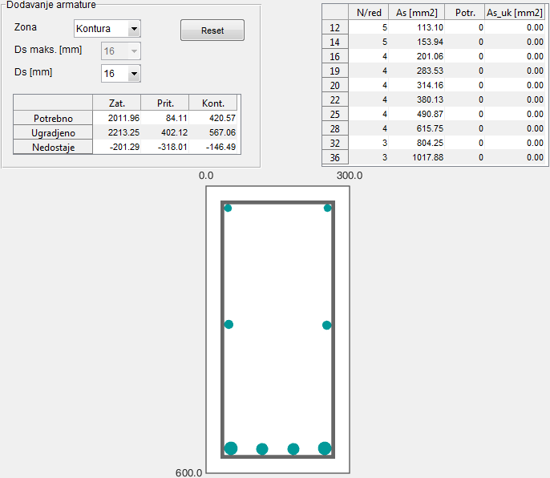

## Interfejs za dimenzionisanje prema momentu torzije {#interfejs-za-dimenzionisanje-prema-momentu-torzije}

Grafički interfejs za dimenzionisanje presjeka prema momentu torzije je sličan onom za transverzalnu silu, s tim da u njemu ne postoji više mogućnost zadavanja ugla jer se za prenos momenta torzije uzengije ugrađuju isključivo pod uglom od , ali zato postoji dodatno polje za unos (slika 14.1). Klikom na dugme _Izračunaj s_ program računa potrebnu količinu poprečne armature kao što je opisano u dijelu 10\. S obzirom da u Evrokodu ne postoje jasne smjernice koji dio presjeka aktivno učestvuje u prenosu momenta torzije kada su u pitanju nekonveksni presjeci, u slučaju T presjeka program vrši proračun nosivosti samo za rebro, zanemarujući flanše. Odgovor na ovo pitanje će se dobiti nekim budućim opsežnim ispitivanjem.

Program sabira potrebnu količinu poprečne armature za oba uticaja, vodeći računa o maksimalnom dopuštenom razmaku između uzengija, dok se dodatna podužna armatura računa odvojeno. Razlog za to je već spomenut u dijelu 10.4: naime preuzimanje dodatne sile zatezanja od transverzalne sile se u praksi vrši prepuštanjem glavne podužne armature dok se za preuzimanje dodatne sile zatezanja od momenta torzije po konturi presjeka raspoređuje dodatna podužna armatura.

Rezultat proračuna se prikazuje tabelarno:

razmak između konturnih uzengija, koje prenose kompletan moment torzije i dio transverzalne sile,

razmak između unutrašnjih uzengija, u slučaju kada je sječnost (u većini slučajeva je ),

za minimalnu vrijednost ugla za koju je vrijednost interakcione funkcije jednaka jedinici,

ukupna potrebna količina poprečne armature koja odgovara ,

dodatna količina podužne armature za preuzimanje dodatne sile zatezanja od momenta torzije, koja se raspoređuje po konturi presjeka,

dužina prepuštanja glavne podužne armature radi preuzimanja dodatne sile zatezanja od transverzalne sile.

Pored toga, program prikazuje dijagram funkcionalne zavisnosti između interakcione funkcije i ukupne količine poprečne armature, kao što se vidi na slici 14.1\. Crvena tačka na dijagramu označava potrebnu količinu poprečne armature za koju je vrijednost interakcione funkcije jednaka jedinici.

Nakon toga, korisnik ima mogućnost da usvoji razmake uzengija i , pri čemu program vodi računa da razmak ne smije biti veći od horizontalne projekcije kose prsline () kako bi se osiguralo da unutrašnje uzengije takođe sijeku kosu prslinu, tj. ravnomjerno učestvuju u prenošenju dijela transverzalne sile.

Za tako usvojenu količinu poprečne armature program računa ostale parametre koje prikazuje u tabeli ispod potrebnih vrijednosti. Usvojena količina poprečne armature je označena zelenom tačkom na dijagramu, što omogućava korisniku bolji pregled ostvarene rezerve nosivosti presjeka.

Slika 14.1 – Grafički interfejs za dimenzionisanje prema momentu torzije i transverzalnoj sili

U posljednjem koraku, klikom na dugme _Dodaj podužnu armaturu..._ otvara se ponovo prozor za dodavanje armature gdje su sada u lijevoj tabeli prikazane ukupne potrebne količine podužne armature po odgovarajućim zonama presjeka (slika 14.2).

Slika 14.2 – Potrebna i usvojena količina podužne armature po zonama presjeka (lijeva tabela)

U slučaju pravougaonog presjeka, raspodjela podužne armature po konturi presjeka se vrši na sledeći način:

dodatna podužna armatura koja se ugrađuje u zategnutu zonu,

dodatna podužna armatura koja se po potrebi ugrađuje u pritisnutu zonu,

dodatna podužna armatura koja se ugrađuje ravnomjerno po lijevoj i desnoj konturi presjeka,

pri čemu se i definišu na sledeći način:

Dodatna količine podužne armature u zategnutoj zoni sabira se sa prethodno izračunatom količinom za prijem momenta savijanja :

U slučaju pritisnute zone, s obzirom da dvije projektovane količine podužne armature imaju suprotno djelovanje ( nosi dio sile pritiska od momenta savijanja, dok nosi dio sile zatezanja od momenta torzije), a imajući u vidu da moment torzije obično djeluje po čitavoj dužini, dok kritični moment savijanja djeluje samo na ograničenom dijelu nosača, nije potrebno oduzimati te dvije količine jednu od druge, nego je dovoljno usvojiti onu koja je veća:

Na taj način osigurava se potrebna količina podužne armature u pritisnutoj zoni u svakom presjeku nosača.