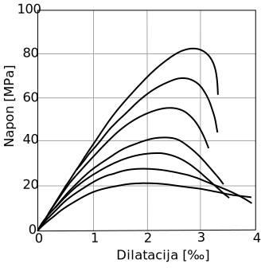

## Dijagram napon-dilatacija {#dijagram-napon-dilatacija}

### Beton {#beton}

Mnogobrojna eksperimentalna istraživanja obavljena na betonskim uzorcima koji su opterećeni silama pritiska do loma, pokazala su da oblik veze između napona i dilatacija zavisi od niza faktora. Oblik dijagrama i veličine krajnjih dilatacija u poprečnim presjecima zavise između ostalog od: naponskog stanja elementa, klase betona, brzine nanošenja opterećenja, oblika poprečnog presjeka i količina pritisnute i poprečne armature u presjeku.

Tipičan dijagram napon-dilatacija dobijen ispitivanjem aksijalno opterećenih cilindičnih uzoraka \(d/h = 15/30 cm\) različitih klasa betona \(od C25 do C90\), pri djelovanju kratkotrajnog opterećenja, prikazan je na slici 5.1.

| Slika 5.1 - Dijagrami napon-dilatacija za različite klase betona | Slika 5.2 - Šematski prikaz dijagrama napon-dilatacija za beton |
| --- | --- |
|  |  |

Sa porastom opterećenja koje se nanosi u relativno kratkom periodu, podužne deformacije rastu kvazi-linearno do napona koji je približno jednak polovini maksimalnog napona, nakon čega kriva postaje izrazito nelinearna. Maksimalan napon koji ujedno predstavlja i srednju čvrstoću betona se dostiže pri dilatacijama koje se kreću između 2 i 3‰, a zatim čvrstoća postepeno opada. Kompletan lom uzorka dešava se pri dilatacijama većim od 3‰ \(\) – slika 5.2.

Na slici 5.1 se vidi da niže klase betona ispoljavaju duktilnije ponašanje \(približno održavanje konstantnog napona pri povećanju dilatacija iznad kritične vrijednosti\), dok se kod viših klasa betona dešava krt lom \(naglo opadanje napona pri povećanju dilatacija iznad kritične vrijednost\) i to pri nižim vrijednostima dilatacija u poređenju sa nižim klasama betona. Zbog toga su u Evrokodu propisane nešto niže granične dilatacije za betone preko klase C50/60.

Izražena linearnost krive na početku nanošenja opterećenja dopušta proračun sa konstantnim modulom elastičnosti betona u cijeloj oblasti napona koji odgovaraju naponima u stanju eksploatacije, odnosno naponima . U ovoj oblasti može se usvojiti srednja vrijednost modula elastičnosti betona \(\) koja se, pri starosti betona dana, prema EC2 određuju kao na slici 5.2.

### Radni dijagram betona \(RDB\) {#radni-dijagram-betona-rdb}

Kako bi se omogućio jedinstven proračun po lomu, nezavisno od prethodno spomenutih faktora koji utiču na oblik dijagrama, standardom se utvrđuje jedinstven dijagram veze napon-dilatacija za beton u oblasti pritiska, tzv. idealizovani ili _radni dijagram betona_ \(RDB\). Ovakav dijagram približno opisuje stvarno ponašanje betona u oblasti loma, ali je jednostavnijeg oblika u odnosu na stvarni, čime se postiže i jednostavniji proračun.

Slika 5.3 - Radni dijagram betona parabola-pravac

Evrokod definiše tri oblika idealizovanih dijagrama napon-dilatacija za proračun betonskih presjeka:

1. dijagram parabola-pravac
2. bilinearni dijagram
3. pravougaoni dijagram

U ovom radu biće korišten dijagram parabola-pravac \(slika 5.3\), koji je prema EC2 definisan sledećim izrazom:

\(5.1\) $$x = y^2$$ //test$$x = y$$

\frac{n!}{k!\(n-k\)!}

pri čemu je:

dilatacija pri kojoj se ostvaruje maksimalna vrijednost napona u betonu \(za klase betona : \),

granična dilatacija pri kojoj nastupa lom betona \(za klase betona : \),

eksponent, zavisi od klase betona \(za klase betona \).

Pobrojani parametri propisani su Evrokodom i njihove vrijednosti su date za sve klase betona na kraju rada u prilogu _A_.

U prethodnom izrazu predstavlja računsku čvrstoću betona na pritisak koja se definiše kao:

koeficijent kojim se uzima u obzir negativan uticaj dugotrajnog opterećenja na čvrstoću betona, kao i načina nanošenja opterećenja,

karakteristična čvrstoća betona na pritisak koja odgovara fraktilu 5% \(to znači da najviše 5% testiranih uzoraka može da ima manju čvrstoću od odgovarajuće klase betona\),

parcijalni faktor sigurnosti za beton \(za onsovne kombinacije opterećenja usvaja se \).

### Armatura {#armatura}

Tipičan dijagram napon-dilatacija \(pri pritisku ili zatezanju\) za čelike različitog kvaliteta prikazan je na slici 5.4. Početni dio dijagrama je prava linija \(za sve vrste čelika\) koja predstavlja područje elastičnosti.

Za vruće valjane čelike \(RA, odnosno klasa B prema EC2\) jasno je izražena linearnost na dijagramu napon-dilatacija sve do _granice razvlačenja_, koja se prema Evrokodu označava sa i predstavlja područje gdje dilatacija naglo raste bez značajnijeg povećanja napona. Granica tečenja se uzima i kao tehnička granica elastičnosti – slika 5.5a. To su vrlo žilavi čelici, kod kojih se dostižu znatne dilatacije pri kidanju \(kod glatkih čelika dilatacija pri kidanju može dostići i 26 % – slika 5.4.

Slika 5.4 - Dijagrami napon - dilatacija za različite vrste čelika

Za hladno vučene čelike \(MA i BiA, klasa A prema EC2\), granica razvlačenja nije jasno izražena, pa se stoga definiše konvencionalna tehnička granica razvlačenja – slika 5.5b. Ona predstavlja napon pri kom zaostala \(nepovratna\) dilatacija poslije rasterećenja uzorka iznosi 0,2%. Vrijednost predstavlja dilataciju pri kojoj je zabilježena maksimalna vrijednost napona.

Slika 5.5 – Granica tečenja za a\) vruće valjani čelik i b\) hladno vučeni čelik

### Radni dijagram čelika \(RDČ\) {#radni-dijagram-elika-rd}

U oblasti stanja loma nosača po armaturi, napon u njoj dostiže granicu razvlačenja , odnosno . Vrijednosti su definisane nacionalnim standardima, a predviđeni raspon prema EC2 je .

Slika 5.6 – Radni dijagram čelika

Prema Evrokodu, za radni dijagram čelika može se koristiti bilinearni oblik dijagrama sa horizontalnim ili kosim gornjim krakom prikazan na slici 5.6. Dijagram sa horizontalnim gornjim krakom podrazumijeva idealno elastično ponašanje čelika sve do granice tečenja, a po dostizanju ove granice, čelik se dalje ponaša kao idealno plastičan materijal. Vrijednost napona predstavlja računsku granicu razvlačenja koja se dobija dijeljenjem karakteristične vrijednosti sa parcijalnim koeficijentom sigurnosti za čelik \(za osnovne kombinacije opterećenja usvaja se \).

Dijagram sa horizontalnim gornjim krakom može se definisati sledećim izrazom:

\(5.2\)

pri čemu je – dilatacija pri naponu tečenja. Za vrijednost modula elastičnosti preporučuje se .

Za razliku od BAB-a 87, Evrokod ne ograničava maksimalnu vrijednost dilatacija u armaturi ukoliko se koristi horizontalan gornji krak na računskom dijagramu čelika. U situacijama kada se iz graničnih uslova loma dobiju previsoke dilatacije u armaturi, biće svakako mjerodavni granični uslovi upotrebljivosti koji se odnose na dopuštene ugibe i širine prslina.

Ukoliko se pri proračunu koristi gornja grana pod nagibom, preporučuje se ograničenje dilatacija . Preko koeficijenta standard ograničava odnos maksimalnog napona i granice tečenja .

Dijagram sa kosom gornjom granom može se definisati sledećim izrazom:

\(5.3\)

pri čemu predstavlja odnos maksimalnog napona i napona na granici tečenja \(\).

Na dijagramu su u zagradama navedene preporučene \(minimalne\) vrijednosti parametara za klasu čelika B \(vruće valjani čelik\) prema Evrokodu.

